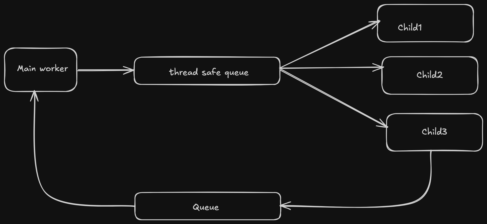

# API Status Monitor

A Python based system for monitoring API status and handling service degradation with exponential backoff retry mechanisms.

## Project Overview

This project implements a multi-threaded monitoring system that tracks the status of OpenAI's API status. It features:

- Real-time monitoring of API health
- Multi-threaded architecture for efficient monitoring
- Exponential backoff strategy for failed requests
- Intelligent response parsing and status tracking
- Structured logging system

Architecture Diagram


## Project Structure

```
├── api_client/
│   └── open_ai_api_client.py    # OpenAI API client implementation
├── factory/
│   ├── monitor_factory.py       # Factory for creating monitors
│   └── response_parser_factory.py # Factory for response parsers
├── parser/
│   └── open_ai_api_response_parser.py # Parser for OpenAI API responses
├── driver.py                    # Main entry point
├── monitor.py                   # Core monitoring system
├── logger.py                    # Logging configuration
└── requirements.txt            # Project dependencies
```

## Features

- **Multi-threaded Monitoring**: Uses a main worker thread for initial status checks and child workers for detailed monitoring of degraded services
- **Exponential Backoff**: Implements smart retry logic with configurable intervals (1 min to 10 min)
- **Factory Pattern**: Utilizes factories for monitor and response parser creation, making it easy to add support for new APIs
- **Structured Logging**: Comprehensive logging system for tracking monitoring activities
- **Thread-safe Queues**: Manages communication between main and child workers using thread-safe queues

## Requirements

- Python 3.x
- Dependencies listed in `requirements.txt`:
  - requests==2.32.4
  - pytest==8.4.2

## Installation

1. Clone the repository
2. Install dependencies:
```bash
pip install -r requirements.txt
```

## Configuration

Set the following environment variable:
- `OPEN_API_BASE_URL`: Base URL for the OpenAI API status endpoint

## Usage

Run the monitor:
```bash
python driver.py
```

The system will start monitoring configured endpoints and log their status. Press Ctrl+C to stop monitoring.

## Monitoring System Architecture

The system consists of:
1. **Main Worker**: Performs initial health checks and manages the monitoring workflow
2. **Child Workers**: Monitor specific endpoints that show signs of degradation
3. **Recovery Queue**: Manages communication about recovered services
4. **Downtime Queue**: Manages services that need detailed monitoring
